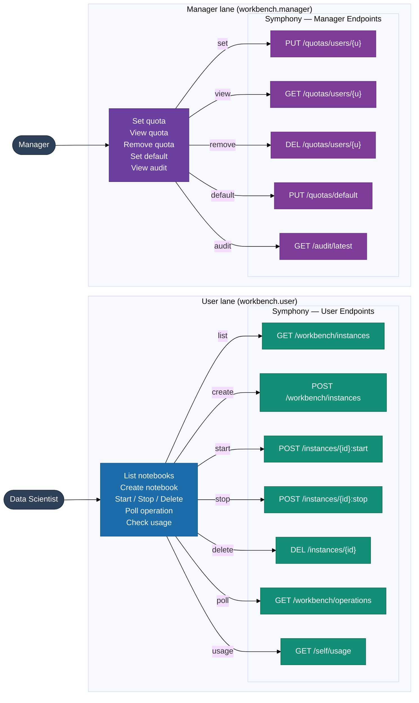
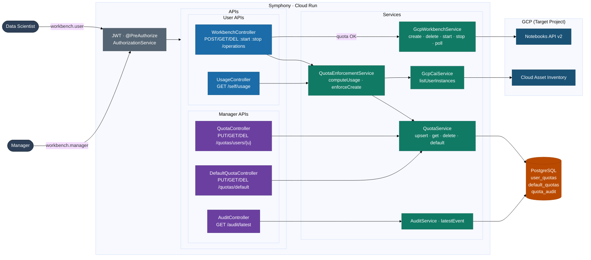
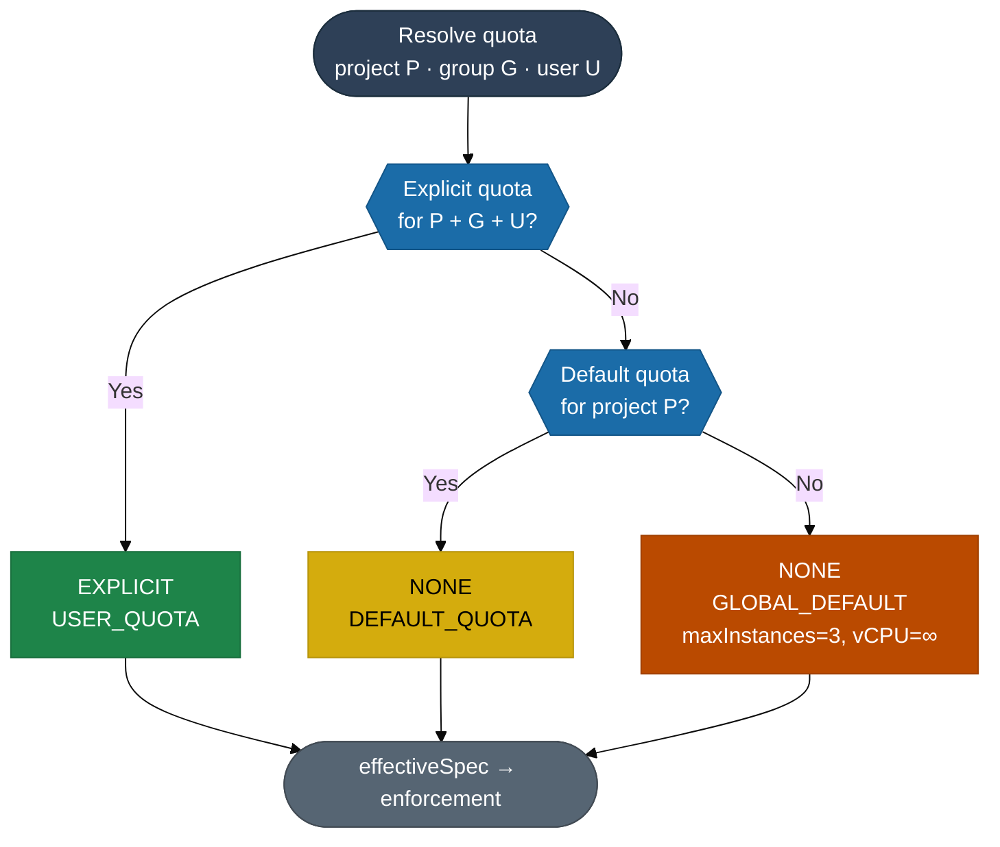
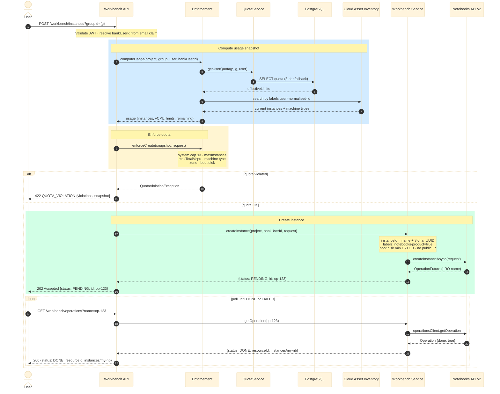
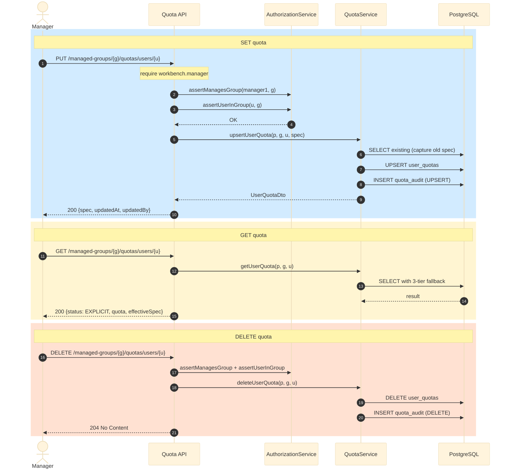

# Symphony — Architecture & Workflow Diagrams

---

## 0 · UI Integration Overview

---

## 1 · Component Architecture

---

## 2 · Quota Resolution  (3-tier fallback)

---

## 3 · Create Instance  (end-to-end sequence)

---

## 4 · Quota Management  (manager sequence)

